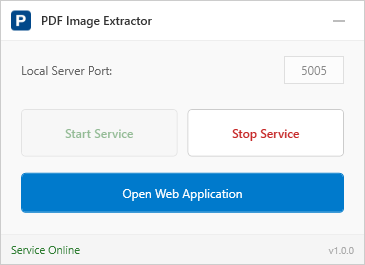
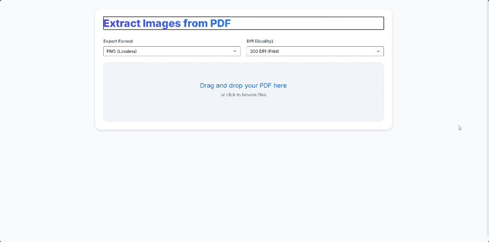

# PDF Image Extractor

<p align="center">
  
</p>

A Windows application to extract high-quality images from PDF files with ease.

## ✨ Features

- **🖼️ High-Quality Extraction** - Export pages as PNG, JPG, BMP, or WEBP
- **📐 Custom DPI Settings** - Choose from 72 to 600 DPI for optimal quality
- **📦 Batch Download** - Download all images as a ZIP with one click
- **🖥️ System Tray Integration** - Runs quietly in the background
- **🌐 Web Interface** - Modern, responsive UI accessible from any browser

## 📸 Screenshots

### Web Application
<p align="center">
  
</p>

### Tray Application
<p align="center">
  
</p>

## 🚀 Installation

1. Download the latest release
2. Run `Setup.exe`
3. Follow the installation wizard
4. Launch from Desktop or Start Menu

## 💻 Usage

1. **Start the Service** - Click "Start Service" in the tray application
2. **Open Web App** - Click "Open Web Application" or navigate to `http://localhost:5005`
3. **Upload PDF** - Drag & drop or click to browse
4. **Configure Export** - Select format and DPI quality
5. **Download** - Save individual images or download all as ZIP

## 🛠️ Tech Stack

- **Backend**: ASP.NET Core Blazor Server (.NET 10)
- **Frontend**: Blazor with modern CSS
- **Desktop**: WPF with MVVM architecture
- **PDF Processing**: PDFtoImage library

## 📁 Project Structure

```
PdfImageExtractor/
├── PdfImageExtractor.Blazor/   # Web application
├── PdfImageExtractor.Wpf/      # Tray application
├── InstallerLauncher/          # Setup.exe launcher
└── install.ps1                 # Installation script
```

## 🔧 Building from Source

```powershell
# Clone the repository
git clone https://github.com/fmoghaddampoor/PdfImageExtractor.git

# Build and run installer
cd PdfImageExtractor
dotnet publish PdfImageExtractor.Blazor -c Release -o publish/Data/Server
dotnet publish PdfImageExtractor.Wpf -c Release -o publish/Data/Tray
dotnet publish InstallerLauncher -c Release -r win-x64 --self-contained false -o publish /p:AssemblyName=Setup
Copy-Item install.ps1 publish/Data/install.ps1
```

## 📄 License

MIT License - feel free to use and modify!

---

<p align="center">
  Made with ❤️ by <a href="https://github.com/fmoghaddampoor">Farzad Moghaddampoor</a>
</p>
